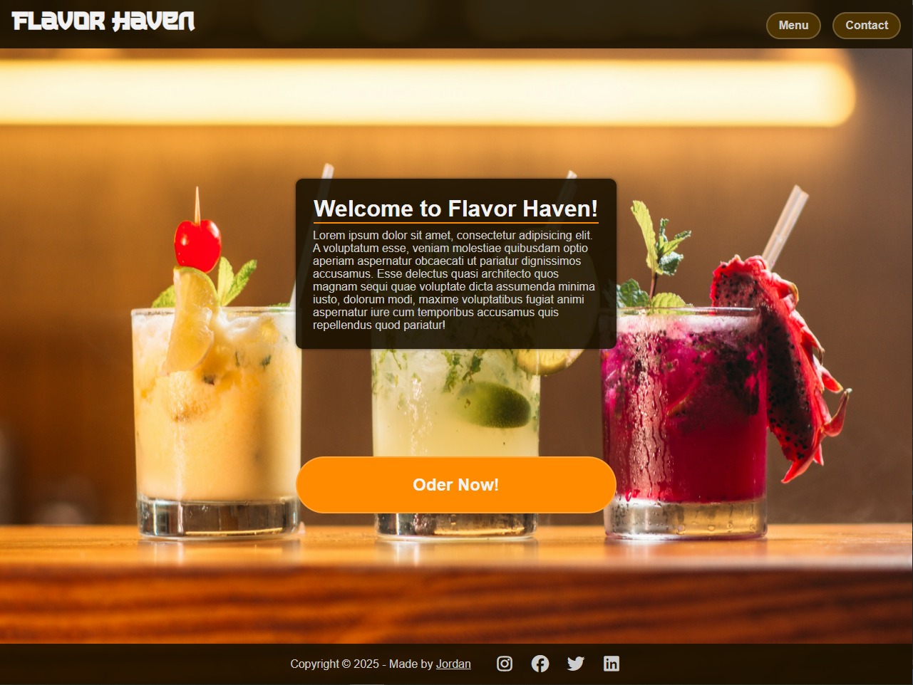

# About
This is a simulated restaurant page for practice with Webpack.
It uses JavaScript alone to generate the entire contents of the website.

## Tech Stack
**Client-side:**
- HTML5 – Semantic structure and layout
- CSS3 – Styling and responsive design
- JavaScript (ES6+) – Dynamic content and modular architecture

**Tooling & Build:**
- Webpack – Module bundling and asset management
- npm – Package management
- Git – Version control

**Deployment:**
- GitHub – Code hosting
- GitHub Pages – Static site deployment

## Live Demo

The deployed version of the project: [Restaurant Page](https://jordan-am.github.io/restaurant-page/)

## Preview

